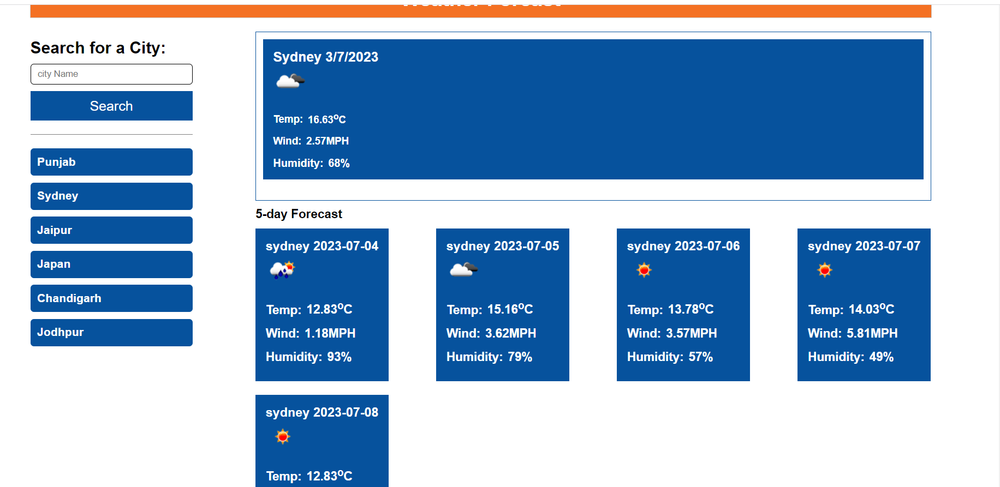
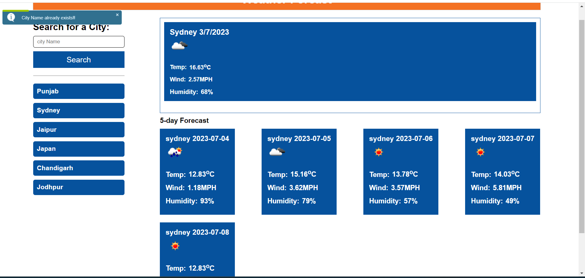
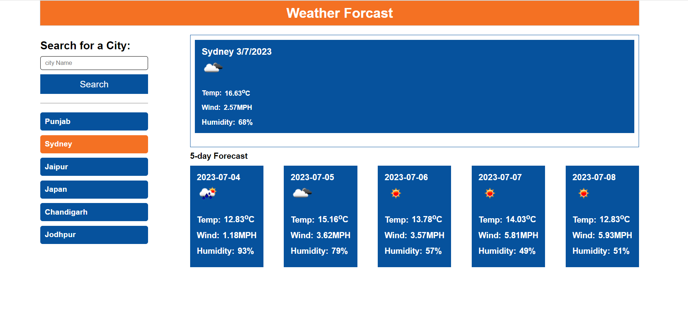
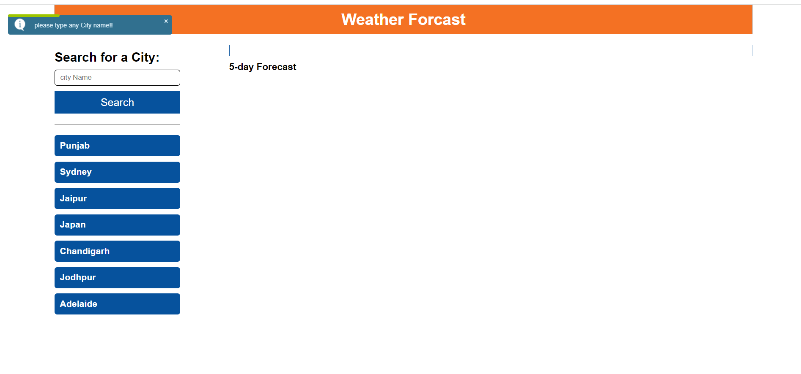

# weatherForcast

This is a weather forcast  application using HTML, CSS, and Javascript. In this application ,user can search curent weather and next five days weather according to their search city. Even you don't need to search again and again if you already search because you can see searched city  in the left side,just click on it , see weather of your choice. if user can search same city, ,can see message that alrady exist  by Toast Plugin so its easier for user to not to type again , jsut click on left side searched cities. you can delete from search history if you want

This project has been deployed to GitHub Pages. To get this project up and running, you can follow the deployment link. Or, download the sources files to use this as a template.

* [GitHub Repository]https://github.com/LipikaManglaa/weatherForcast.git
* [Deployed GitHub IO]https://lipikamanglaa.github.io/weatherForcast/

### Prerequisites

To install this application, you will need a text editor. I recommend Visual Studio Code. 

### Installing

To install this code, download the zip file, or use GitHub's guidelines to clone the repository. 

##  User Story:
**AS  need to know current weather and forcast next five days weather for everyone**
- I WANT to see current and forcast weather
- SO THAT I can manage according to weather

**# This project has the following features: **
- When user search the city
  - current and forcast weather is displayed in the right side 

  

- When user can see more features,
  - They're presented with with temparture, windy, humidity , how it looks like ,image can show cloudy,rainy,sunny etc.

- When the user type again city name data 
 -it can shows by Toast Plugin  ,city name already exists

 

- If user already serach city
  - Each time doesnt need to type again , just click on left side city which will be highlighted, to see weather
 

- When the user does not type any city , just click on serach button 
 -it can shows by Toast Plugin  ,please type city name

 
 

 ### This project has media Queries for:

* max-width: 991px 
    * Adjusts body and container width

* max-width: 767px
    * Adjusts body and container width

* max-width: 567px
    * Adjusts body and container width  
